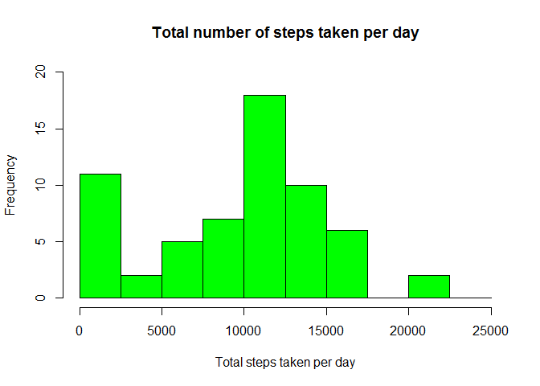
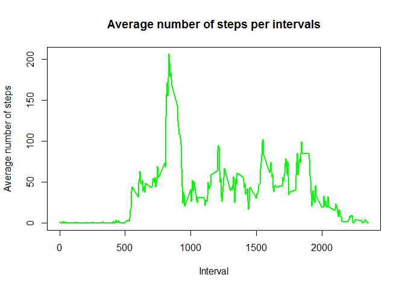
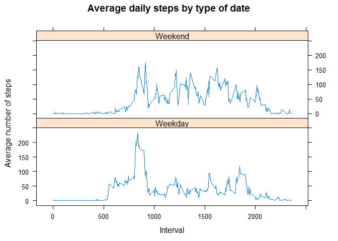

## Loading and preprocessing the data
to unzip the data and obtain a csv file, reading the data into activity data frame


```r
activity<- read.csv(unz("activity.zip", "activity.csv"))
str(activity)
```

```
## 'data.frame':	17568 obs. of  3 variables:
##  $ steps   : int  NA NA NA NA NA NA NA NA NA NA ...
##  $ date    : Factor w/ 61 levels "2012-10-01","2012-10-02",..: 1 1 1 1 1 1 1 1 1 1 ...
##  $ interval: int  0 5 10 15 20 25 30 35 40 45 ...
```

```r
# we need to convert the class of date from factor to POSIXct
activity$date<- as.POSIXct(activity$date, format= "%Y-%m-%d")
weekday<- weekdays (activity$date)
activity<- cbind(activity, weekday)
str(activity)
```

```
## 'data.frame':	17568 obs. of  4 variables:
##  $ steps   : int  NA NA NA NA NA NA NA NA NA NA ...
##  $ date    : POSIXct, format: "2012-10-01" "2012-10-01" ...
##  $ interval: int  0 5 10 15 20 25 30 35 40 45 ...
##  $ weekday : Factor w/ 7 levels "Friday","Monday",..: 2 2 2 2 2 2 2 2 2 2 ...
```

```r
summary (activity)
```

```
##      steps             date               interval           weekday    
##  Min.   :  0.00   Min.   :2012-10-01   Min.   :   0.0   Friday   :2592  
##  1st Qu.:  0.00   1st Qu.:2012-10-16   1st Qu.: 588.8   Monday   :2592  
##  Median :  0.00   Median :2012-10-31   Median :1177.5   Saturday :2304  
##  Mean   : 37.38   Mean   :2012-10-31   Mean   :1177.5   Sunday   :2304  
##  3rd Qu.: 12.00   3rd Qu.:2012-11-15   3rd Qu.:1766.2   Thursday :2592  
##  Max.   :806.00   Max.   :2012-11-30   Max.   :2355.0   Tuesday  :2592  
##  NA's   :2304                                           Wednesday:2592
```

## What is mean total number of steps taken per day?

```r
activity_total_steps <- with(activity, aggregate(steps, by = list(date), FUN = sum, na.rm = TRUE))
names(activity_total_steps) <- c("date", "steps")
hist(activity_total_steps$steps, main = "Total number of steps taken per day", xlab = "Total steps taken per day", col = "green", ylim = c(0,20), breaks = seq(0,25000, by=2500))
```

<!-- -->

```r
# mean of total No of steps taken per day
mean (activity_total_steps$steps)
```

```
## [1] 9354.23
```

```r
# median of total No of steps taken per day
median(activity_total_steps$steps)
```

```
## [1] 10395
```

## What is the average daily activity pattern?
- Make a time series plot (i.e. type = "l") of the 5-minute interval (x-axis) and the average number of steps taken, averaged across all days (y-axis)


```r
average_daily_activity <- aggregate(activity$steps, by=list(activity$interval), FUN=mean, na.rm=TRUE)
names(average_daily_activity) <- c("interval", "mean")
plot(average_daily_activity$interval, average_daily_activity$mean, type = "l", col="green", lwd = 2, xlab="Interval", ylab="Average number of steps", main="Average number of steps per intervals")
```

<!-- -->


- Which 5-minute interval, on average across all the days in the dataset, contains the maximum number of steps?


```r
average_daily_activity[which.max(average_daily_activity$mean), ]$interval
```

```
## [1] 835
```

## Imputing missing values

- Calculate and report the total number of missing values in the dataset (i.e. the total number of rows with NAs)


```r
sum(is.na (activity$steps))
```

```
## [1] 2304
```


- Devise a strategy for filling in all of the missing values in the dataset. The strategy does not need to be sophisticated. For example, you could use the mean/median for that day, or the mean for that 5-minute interval, etc.


```r
new_steps <- average_daily_activity$mean[match(activity$interval, average_daily_activity$interval)]
```

- Create a new dataset that is equal to the original dataset but with the missing data filled in


```r
activity_new <- transform(activity, steps = ifelse(is.na(activity$steps), yes = new_steps, no = activity$steps))
total_steps_new <- aggregate(steps ~ date, activity_new, sum)
names(total_steps_new) <- c("date", "daily_steps")
```

- Make a histogram of the total number of steps taken each day and Calculate and report the mean and median total number of steps taken per day. Do these values differ from the estimates from the first part of the assignment? What is the impact of imputing missing data on the estimates of the total daily number of steps?


```r
hist(total_steps_new$daily_steps, col = "green", xlab = "Total steps per day", ylim = c(0,30), main = "Total number of steps taken each day", breaks = seq(0,25000,by=2500))
```

<!-- -->

mean of total number of steps taken per day


```r
mean(total_steps_new$daily_steps)
```

```
## [1] 10766.19
```

median of total number of steps taken per day


```r
median(total_steps_new$daily_steps)
```

```
## [1] 10766.19
```

the new median and mean becomes similar

## Are there differences in activity patterns between weekdays and weekends?

- Create a new factor variable in the dataset with two levels -- "weekday" and "weekend" indicating whether a given date is a weekday or weekend day


```r
activity$date <- as.Date(strptime(activity$date, format="%Y-%m-%d"))
activity$datetype <- sapply(activity$date, function(x) {
        if (weekdays(x) == "Saturday" | weekdays(x) =="Sunday") 
                {y <- "Weekend"} else 
                {y <- "Weekday"}
                y
        })
```

- Make a panel plot containing a time series plot (i.e. type = "l") of the 5-minute interval (x-axis) and the average number of steps taken, averaged across all weekday days or weekend days (y-axis).


```r
library (lattice)
activity_by_date <- aggregate(steps~interval + datetype, activity, mean, na.rm = TRUE)
xyplot (activity_by_date$steps ~ activity_by_date$interval | activity_by_date$datetype,
        main="Average daily steps by type of date", xlab = "Interval", ylab = 
          "Average number of steps", layout = c(1,2), type = "l")
```

<!-- -->


